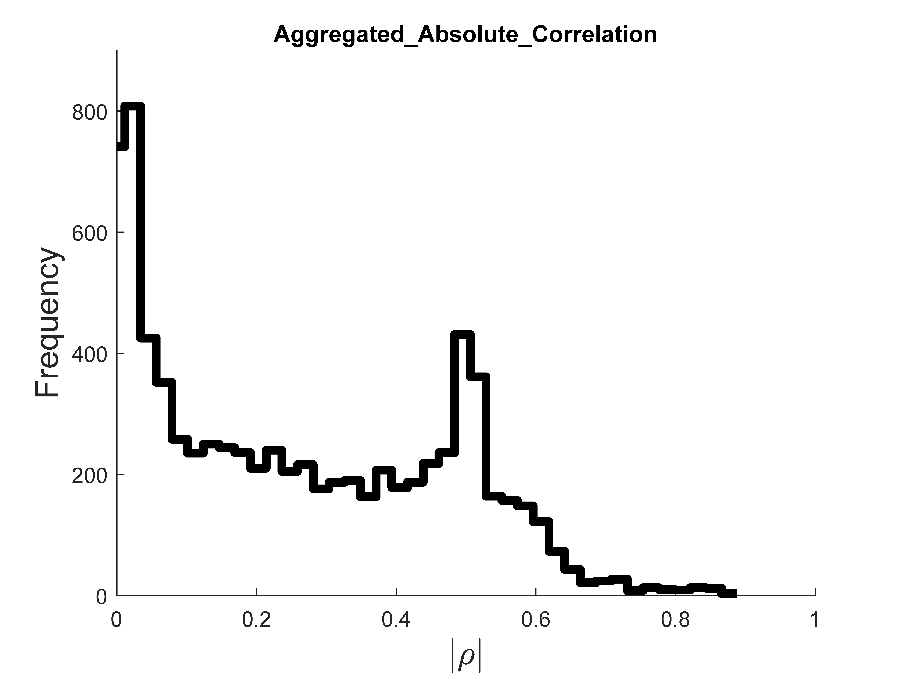

# Criticality
Simulate bifurcating dynamical systems, record time series and run [_hctsa_](https://github.com/benfulcher/hctsa) to produce feature that characterise the dynamical system and its control parameter; then, run analyses to determine which features are most useful for predicting this parameter.

## Setup
In addition to cloning this repository, _hctsa_ v0.98 should be [installed](https://hctsa-users.gitbook.io/hctsa-manual/) in a convenient location and the following modifications performed:
- Add the -v7.3 flag to the save function on line `144` of `TS_init.m` (allowing for larger `.mat` files)
- Change the maximum time series length to 10000000 on line `101` of `SQL_add.m` (allowing for longer time series)
- Use `strcmp` to compare time series labels on lines 207 of `TS_combine`
- Comment out line `194` of `TS_Compute.m`

A workflow begins by adding files to the Matlab path; run `startup()` in the _hctsa_ directory and `add_all_subfolders()` in the _Criticality_ directory.

To reproduce main analyses, refer to the files `testTimeseries.m`, `testHCTSA.md` and `testAnalysis.m` in `./test/`. Below is an outline of a typical workflow-- simulating dynamical systems, running _hctsa_ and analysing feature values.

## Time Series
Stochastic dynamical systems are simulated by the `./Time_Series_Generation/time_series_generator/time_series_generator.m` function using the Euler-Maruyama method. For an example time series with the default parameters:

```java
x = time_series_generator();
```

More complex simulations are defined by name-value pairs or an `inputs` structure which specify a dynamical system, any relevant options and the structure of the output. See `time_series_generator.m` for a full description of input options and their defaults or `TSG_systems.m` for a list of available dynamical systems:

```java
x = time_series_generator('cp_range', [-1, 0], 'etarange', [0.1, 1], 'system_type', 'quadratic_potential');
x = time_series_generator('input_struct', inputs);
x = time_series_generator('input_file', 'inputs.mat');
```

To construct an `inputs` structure, run the function `make_input_struct`. This can be done by directly providing name-value pairs, or by opening a GUI:

```java
inputs = make_input_struct();
```

Alternatively, a blank structure can be created and then filled using Matlab's variable editor:

```java
inputs = make_input_struct(false);
```

## hctsa
If the `foldername` option is provided to `time_series_generator` then the time series will be saved into a _hctsa_ compatible `.mat` file (e.g. `timeseries.mat`). This can be directly transformed into an `HCTSA.mat` file, usually utilising all operations, with:

```java
TS_init('timeseries.mat', [], [], 0);
```
Serial _hctsa_ calculation can then be initiated with:

```java
TS_compute(0, [], [], [], [], 1);
```
Which will fill the `TS_DataMat` array in the `HCTSA.mat` file with time series feature values.

### Distributed Calculations
For massive dynamical system simulations feature calculation can be performed on an HPC cluster; this repository allows distributed computation to be accomplished in three ways.

#### distributed_hctsa
If the time series array is not intractably large it can simply be transferred to a cluster and [distributed_hctsa](https://github.com/benfulcher/distributed_hctsa) (or the slightly modified version at `./PBS/Distributed_hctsa/modified/`) can be used to subset timeseries, calculate features and recombine the results (as detailed in `./docs/USydPhysicsHPC.md`). In this repository the _hctsa_ install directory is assumed to be `~/hctsa_v098/` and the self location is `~/Criticality/`.

#### PBS Array jobs
For larger datasets the process of saving, loading and dividing a single `HCTSA.mat` file becomes extremely slow, so the `save_cp_split` option of `time_series_generator` can be used to directly subset the timeseries at simulation. This option can be set to the number of jobs intended to run on the cluster, as long as this is smaller than the number of different control parameters represented in the dataset. Copying all the subdirectories produced to the cluster, following [the same initialisation](./docs/USydPhysicsHPC.md) of Matlab and _hctsa_ before running `PBS_array_TS_compute.sh` (in the same directory as the time series subdirectories) fills the `HCTSA.mat` subset files with feature values.

Additionally, `time_series_generator` can itself be run on a cluster; `parameter_sweep.m` takes a template input structure and produces subdirectories that each contain an input file varying in the specified option. `PBS_generate_time_series.sh` can then be run on the cluster, in the folder containing these subdirectories, to fill them with a `timeseries.mat` file, after which `PBS_array_TS_compute.sh` can be used to calculate feature values.

#### Integrated _hctsa_
A (very) small number of analyses required datasets too large to save to disk; modified versions of `TS_init` (`./Modified_hctsa/light_TS_init.m`) and `TS_compute` (`./Modified_hctsa/light_TS_compute.m`) bypasses the usual save procedure and ***do not save time series***. These can be used in combination with the `parameter_sweep.m` and `PBS_generate_time_series.sh` files by setting the `integrated_hctsa` option of `time_series_generator` to non-default values (i.e each subdirectory with its own input file will simulate timeseries and calculate feature values, saving ***only*** `HCTSA.mat` subset files to disk-- ***without*** timeseries).

## Feature Analysis
The majority of functions contained in this repository are for analysing the feature array-- `TS_DataMat`-- produced using _hctsa_ from time series datasets formatted by `time_series_generator`. Most operate on a `time_series_data` structure which is produced from an `HCTSA.mat`; many peripheral functions are unimportant but the central analyses are here outlined.

Analysis begins with `./Feature_Analysis/save_data.m`; the working directory should contain an `HCTSA.mat` and an `inputs.mat` file. Then:

```java
save_data('./time_series_data.mat', 'keyword1,keyword2', 'timeseries_source', 'HCTSA.mat', 'inputs.mat');
```

Produces a `time_series_data.mat` file in the current directory keywords, a source annotation, analysis pre-allocations and only the critical portions of the two earlier files-- the `TS_DataMat` array, `Operations` table and `inputs` structure. For distributed calculations, the working directory would instead contain subdirectories each with an `HCTSA.mat` time series subset file and an `inputs_out.mat` options subset file-- `save_data()` options can be used to combine these subsets.

All further analyses now operate on `time_series_data.mat`; some modify the structure it contains, others simply read from or plot it. `./Feature_Analysis/Modify_data/` contains the former; the most crucial are the following, which should be run in order:

```java
group_by_noise('time_series_data.mat', 'time_series_data.mat')
find_correlation('time_series_data.mat', 'Pearson', [-1, 0], 'time_series_data.mat');
```

`group_by_noise` observes the `Inputs` field of the `time_series_data` structure and organises the data such that each row represents one noise parameter (`eta`) and the rows are arranged by increasing control parameter (`cp`). `find_correlation` calculates the correlation for each set of timeseries (each at *one* `eta` value) against the range of `cp` values they represent; in the above example, the `Pearson` linear correlation between control parameters -1 and 0.
In both functions the first and last arguments are the source and destination of the data, respectively.

`./Feature_Analysis/Analyse_data/` holds functions to score and rank features; the most useful are `get_feature_stats`, which accepts a row (and therefore one `eta` value) of `time_series_data`, and `get_combined_feature_stats`, which accepts the entire structure:

```java
tbl1 = get_feature_stats(time_series_data(1, :), {'Absolute_Correlation'})
tbl2 = get_combined_feature_stats(time_series_data, {'Absolute_Correlation'}, {'Absolute_Correlation_Mean'}, [], true);
```

`tbl1` will rank the _hctsa_ features by the magnitude of their correlation to the control parameter, for the noise value represented in the first `time_series_data` row. `tbl2` will average the `Absolute_Correlation` between rows and therefore noise parameters; features will be ranked by their `Absolute_Correlation_Mean`, and `Absolute_Correlation` will be excluded from the table (4th argument).

Finally, `./Feature_Analysis/Plot_Data/` functions help to visualise the `time_series_data`; for instance, the distribution of the statistic `Aggregated_Absolute_Correlation` over all features can be plotted and compared to how it evaluates a single feature-- autocorrelation at lag 1, with `ID` 93 as recorded in the `Operations` field of `time_series_data`:

```java
histogramStat(time_series_data, 'Aggregated_Absolute_Correlation')
plot_feature_vals(93, time_series_data, 'noise', true, [1, 25, 50, 75, 100], true)
```


